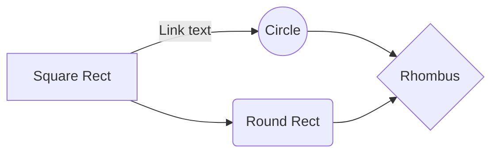

**THIS WAS COMPILED WITH HELP FROM CHATGPT**

# <h1>1. FreeNOS Memory Management System</h1>

## <h2>1A. Identify the specific memory management system used in FreeNOS.</h2>
The specific memory management system used in FreeNOS is a type of segmentation memory management system. Using a series of allocator classes called **SplitAllocator.cpp**, **Allocator.cpp**, **BitAllocator.cpp**, **BubbleAllocator.cpp**, and **PoolAllocator.cpp**. The classes. **Allocator.cpp** and **BitAllocator.cpp** also derive functions from a class called **MemoryBlock.cpp**, which provides basic memory manipulation functions to copy and compare memory blocks. These classes make up the memory management system in FreeNOS.
#### *- SplitAllocator.cpp*
- This allocator is used to allocate both physical and virtual memory, and is the primary allocator used in FreeNOS. It uses a split allocation scheme where physical memory is allocated separately from virtual memory. This allows for efficient use of physical memory by only mapping necessary parts of virtual memory to physical memory.
-  -  Definition and initialization: `SplitAllocator` is defined with the following constructor, which initializes the object with a physical range, a virtual range, and a page size.
```cpp
SplitAllocator::SplitAllocator(const Allocator::Range physRange, const Allocator::Range virtRange, const Size pageSize)
    : Allocator(physRange)
    , m_alloc(physRange, pageSize)
    , m_virtRange(virtRange)
    , m_pageSize(pageSize)
{
}
```

   - -  Memory availability check: `SplitAllocator::available()` checks the amount of available memory.
```cpp
Size SplitAllocator::available() const
{
    return m_alloc.available();
}
```
 - -  Memory allocation: `SplitAllocator::allocate()` is responsible for allocating a range of memory. This is overriding the function from the base class, Allocator.cpp
```cpp
Allocator::Result SplitAllocator::allocate(Allocator::Range & args)
{
    return m_alloc.allocate(args);
}
```
 - -  Sparse memory allocation: `SplitAllocator::allocateSparse()` is responsible for allocating a range of memory in fixed-size pages, and reporting the allocated memory ranges using a callback function.
```cpp
Allocator::Result SplitAllocator::allocateSparse(const Allocator::Range & args,
                                                 CallbackFunction *callback)
{
    const Size allocSize = m_pageSize * 8U;
    if (args.size > m_alloc.available())
    {
        return OutOfMemory;
    } else if (args.size % (allocSize)) {
        return InvalidSize;
    }

    for (Size i = 0; i < args.size; i += allocSize)
    {
        Range alloc_args;
        alloc_args.address = 0;
        alloc_args.size = allocSize;
        alloc_args.alignment = ZERO;

        const Result result = static_cast<Allocator *>(&m_alloc)->allocate(alloc_args);
        if (result != Success)
            return result;

        callback->execute(&alloc_args.address);
    }
    return Success;
}
```
 - -  Memory allocation with virtual address: `SplitAllocator::allocate()` is responsible for allocating a range of memory, and returning the corresponding virtual address and is one of the overloaded functions takend from **Allocation.cpp**.
```cpp
Allocator::Result SplitAllocator::allocate(Allocator::Range & phys, Allocator::Range & virt)
{
    Result r = m_alloc.allocate(phys);
    if (r == Success)
    {
        virt.address   = toVirtual(phys.address);
        virt.size      = phys.size;
        virt.alignment = phys.alignment;
    }
    return r;
}
```
 - -  Memory allocation at a specific address: `SplitAllocator::allocateAt()` is responsible for allocating memory at a specific address and is one of the overloaded functions taken from **Allocation.cpp**.
```cpp
Allocator::Result SplitAllocator::allocate(const Address addr)
{
    return m_alloc.allocateAt(addr);
}
```
- -  Memory release: `SplitAllocator::release()` is responsible for releasing a range of memory.
```cpp
Allocator::Result SplitAllocator::release(const Address addr)
{
    return m_alloc.release(addr);
}
```
- -  Convert physical address to virtual address: `SplitAllocator::toVirtual()` converts a physical address to a virtual address.
```cpp
Address SplitAllocator::toVirtual(const Address phys) const
{
    const Size mappingDiff = base() - m_virtRange.address;
    return phys - mappingDiff;
}
```
 - -  Convert virtual address to physical address: `SplitAllocator::toPhysical()` converts a virtual address to a physical address.
```cpp
Address SplitAllocator::toPhysical(const Address virt) const
{
    const Size mappingDiff = base() - m_virtRange.address
}
```
#### *- Allocator.cpp*
This is the base allocator class that provides a generic interface for allocating and freeing memory. It is used as a base class for other allocators.
 - - `Allocator::Allocator()` is the default constructor for the `Allocator` class. It initializes the `m_parent` member to `ZERO` and sets the `m_range` member to zero using the `MemoryBlock::set()` function.
```cpp
Allocator::Allocator()
    : m_parent(ZERO)
{
    MemoryBlock::set(&m_range, 0, sizeof(m_range));
}
```
 - - `Allocator::Allocator(const Allocator::Range range)` is a constructor that takes an argument `range` of type `Allocator::Range` and initializes the `m_parent` member to `ZERO` and the `m_range` member to the `range` argument. It also checks if the given range is valid and throws an assertion error if not.
```cpp
Allocator::Allocator(const Allocator::Range range)
    : m_parent(ZERO)
    , m_range(range)
{
    assert(m_range.alignment >= sizeof(u32));
    assert(m_range.size >= sizeof(u32));
    assert((m_range.size % m_range.alignment) == 0);
}
```
 - - `Allocator::~Allocator()` is the destructor for the `Allocator` class.
```cpp
Allocator::~Allocator()
{
}
```
 - - `void Allocator::setParent(Allocator *parent)` takes a pointer to an `Allocator` object and sets the `m_parent` member to point to it.
```cpp
void Allocator::setParent(Allocator *parent)
{
    m_parent = parent;
}
```
 - - `Allocator * Allocator::parent()` returns a pointer to the parent `Allocator` object.
```cpp
Allocator * Allocator::parent()
{
    return m_parent;
}
```
 - - `Allocator * Allocator::getDefault()` returns the default `Allocator` object.
```cpp
Allocator * Allocator::getDefault()
{
    return m_default;
}
```
 - - `void Allocator::setDefault(Allocator *alloc)`sets the default `Allocator` object to the argument `alloc`.
```cpp
void Allocator::setDefault(Allocator *alloc)
{
    m_default = alloc;
}
```
 - - `Size Allocator::size() const` returns the size of the `Allocator` range.
```cpp
Size Allocator::size() const
{
    return m_range.size;
}
```
 - - `Address Allocator::base() const` returns the base address of the `Allocator` range.
```cpp
Address Allocator::base() const
{
    return m_range.address;
}
```
 - - `Size Allocator::alignment() const` returns the alignment of the `Allocator` range.
```cpp
Size Allocator::alignment() const
{
    return m_range.alignment;
}
```
 - - `Size Allocator::available() const` returns the available memory of the `Allocator` object, which is the available memory of its parent `Allocator` object.
```cpp
Size Allocator::available() const
{
    return m_parent ? m_parent->available() : ZERO;
}
```
 - - `Allocator::Result Allocator::allocate(Allocator::Range & range)` is a virtual function that returns an `OutOfMemory` error by default. It is meant to be overridden by child classes to implement their own memory allocation strategies.
```cpp
Allocator::Result Allocator::allocate(Allocator::Range & range)
{
    return OutOfMemory;
}
```
 - - `Allocator::Result Allocator::release(const Address addr)` is a virtual function that returns an `InvalidAddress` error by default. It is meant to be overridden by child classes to implement their own memory release strategies.
```cpp
Allocator::Result  Allocator::release(const  Address  addr)
{
	return InvalidAddress;
}
```
 - -  `Address  Allocator::aligned(const Address addr, const Size boundary) const` returns an address that is aligned to the given boundary. It calculates the aligned address by adding the boundary minus the remainder of the address divided by the boundary to the address.
```cpp
Address  Allocator::aligned(const Address addr, const Size boundary) const
{
	Address corrected = addr;
	if (addr % boundary)
		corrected += boundary - (addr % boundary);
	return corrected;
}
```
#### *- BitAllocator.cpp*
This allocator is used to allocate small fixed-size blocks of memory. It maintains a bitmap of the allocated and free blocks and uses bit manipulation operations to efficiently allocate and free blocks.
 - - `BitAllocator::BitAllocator(const Allocator::Range range, const Size chunkSize, u8 *bitmap)`is the constructor for the `BitAllocator` class. It takes in an `Allocator::Range` object, a `Size` for the chunk size, and a pointer to a `u8` array that represents the bitmap. The constructor initializes the `Allocator` superclass with the given range, and initializes the other member variables of the `BitAllocator` class. Specifically, it initializes `m_array` with the size of the range divided by the chunk size, and initializes `m_chunkSize` with the given chunk size. It also initializes `m_lastBit` to 0. The `m_array` member variable is a `BitArray` object that represents the allocation status of each chunk in the range. The `m_chunkSize` member variable specifies the size of each chunk.
```cpp
BitAllocator::BitAllocator(const  Allocator::Range range, const Size chunkSize, u8 *bitmap)
	: Allocator(range)
	, m_array(range.size  / chunkSize, bitmap)
	, m_chunkSize(chunkSize)
	, m_lastBit(0)
{
} 
```
 - - `Size BitAllocator::chunkSize() const` is a getter function that returns the chunk size of the allocator.
```cpp
Size  BitAllocator::chunkSize() const
{
	return m_chunkSize;
}  
```
 - - `Size BitAllocator::available() const` is a getter function that returns the amount of available memory in the allocator. It does this by counting the number of free chunks in the `m_array` member variable, and multiplying that count by the chunk size.
```cpp
Size  BitAllocator::available() const
{
	return  m_array.count(false) * m_chunkSize;
}
```
 - - `Allocator::Result BitAllocator::allocate(Allocator::Range &args)` attempts to allocate a range of memory of the given size and alignment.It does this by calling the `allocateFrom()` function with `m_lastBit` as the starting bit. If that function returns `OutOfMemory`, it calls `allocateFrom()` again with a starting bit of 0. If `allocateFrom()` returns `Success`, this function also sets `m_lastBit` to the returned bit index, so that the next call to `allocate()` will start searching for free memory from that index. This function returns the result of the `allocateFrom()` function.
```cpp
Allocator::Result  BitAllocator::allocate(Allocator::Range  &  args)
{
	Allocator::Result result =  allocateFrom(args, m_lastBit);
	if (result == OutOfMemory)
	{
		return  allocateFrom(args, 0);
	} else {
	return result;
	}
}
```
 - - `Allocator::Result BitAllocator::allocateFrom(Allocator::Range &args, const Size startBit)`attempts to allocate a range of memory of the given size and alignment, starting from the given bit index. It does this by calling the `setNext()` function of the `m_array` member variable to find the next `num` free chunks starting from the given `startBit`, with the given `alignment`. If `setNext()` returns `BitArray::Success`, this function sets the address of the given `args` object to the start address of the allocated memory, and sets `m_lastBit` to the returned bit index. This function returns `Success` if the allocation was successful, or `OutOfMemory` if there was not enough free memory available.
```cpp 
Allocator::Result  BitAllocator::allocateFrom(Allocator::Range  &  args, const  Size  startBit)
{
	Size num = (args.size) / m_chunkSize;
	BitArray::Result result;
	Size bit, alignment =  1;  
	if ((args.size) % m_chunkSize)
		num++;  
	if (args.alignment)
	{
		if (args.alignment  % m_chunkSize)
			return InvalidAlignment;
		else
			alignment =  args.alignment  / m_chunkSize;
	}
	result =  m_array.setNext(&bit, num, startBit, alignment);
	if (result !=  BitArray::Success)
		return OutOfMemory;
	args.address  =  base() + (bit * m_chunkSize);
	assert(isAllocated(args.address));
	m_lastBit = bit;
	return Success;
}
```
 - - `Allocator::Result BitAllocator::allocateAt(const Address addr)`attempts to allocate a chunk of memory at the given address. It does this by calling the `set()` function of the `m_array` member variable to set the bit corresponding to the given address. This function returns `Success` if the allocation was successful.
```cpp
Allocator::Result  BitAllocator::allocateAt(const  Address  addr)
{
	assert(!isAllocated(addr)); 
	m_array.set((addr -  base()) / m_chunkSize);
	return Success;
}
```
 - - `bool BitAllocator::isAllocated(const Address addr) const` returns true if the chunk of memory starting at the given address has been allocated. It does this by checking if the bit corresponding to the given address in the `m_array` member variable is set.
```cpp
bool  BitAllocator::isAllocated(const  Address  addr) const
{
	assert(addr >=  base());
	assert(addr <  base() +  size());
	assert(((addr -  base()) % m_chunkSize) ==  0);
	return  m_array.isSet((addr -  base()) / m_chunkSize)
}
```
 - - `Allocator::Result BitAllocator::release(const Address addr)`releases the memory
allocated at the specified address by unsetting the corresponding bit in the internal bit array of the allocator. It first checks whether the specified address is valid, i.e., it is within the range of addresses managed by the allocator and is aligned to the chunk size of the allocator. If the specified address is not valid, the function returns an InvalidAddress error. If the address is valid, the function unsets the bit corresponding to the chunk containing the specified address and returns a Success result.
```cpp
Allocator::Result  BitAllocator::release(const  Address  addr)
{
	assert(isAllocated(addr));
	m_array.unset((addr -  base()) / m_chunkSize);
	return Success;
}
```
#### *- BubbleAllocator.cpp*
This allocator is used to allocate variable-sized blocks of memory. It uses a buddy system algorithm to manage the memory space, where memory is divided into blocks of sizes that are powers of 2. The allocator maintains a binary tree structure to track free and allocated blocks.
 - - `BubbleAllocator::BubbleAllocator(const Allocator::Range range)` is the constructor for the `BubbleAllocator` class. It initializes the parent `Allocator` with the provided memory range and sets the `m_allocated` member variable to 0.
```cpp
BubbleAllocator::BubbleAllocator(const  Allocator::Range range) : Allocator(range) 
	, m_allocated(0)
{
}
```
 - - `Size BubbleAllocator::available() const` returns the amount of available memory in the allocator, which is equal to the size of the range minus the amount of memory that has already been allocated (`m_allocated`).
```cpp
Size  BubbleAllocator::available() const
{
	return  size() - m_allocated;
}
```
 - - `Allocator::Result BubbleAllocator::allocate(Allocator::Range & args)` attempts to allocate a block of memory of the specified size and alignment in the allocator. It first calculates the amount of memory needed by calling the `aligned` function to align the size with the allocator's alignment. If there is enough space available in the allocator for the requested memory, it sets the `args.address` parameter to the base address of the allocator plus the amount of memory that has already been allocated (`m_allocated`), and increases `m_allocated` by the amount of memory that was just allocated. If there is not enough space available, it returns an `OutOfMemory` result.
```cpp
Allocator::Result  BubbleAllocator::allocate(Allocator::Range  &  args)
{
	Size needed =  aligned(args.size, alignment());  
	// Do we still have enough room?
	if (m_allocated + needed <=  size())
	{
		args.address  =  base() + m_allocated;
		m_allocated += needed;
		return Success;
	}
	// No more memory available
	return OutOfMemory;
}
```
 - - `Allocator::Result BubbleAllocator::release(const Address addr)` attempts to release the memory at the specified address. However, since the `BubbleAllocator` does not support releasing memory, this function always returns an `InvalidAddress` result.
```cpp
Allocator::Result  BubbleAllocator::release(const  Address  addr)
{
	// BubbleAllocator never releases memory
	return InvalidAddress;
}
```
#### *- PoolAllocator.cpp*
This allocator is used to allocate small fixed-size blocks of memory from a pre-allocated memory pool. It is designed to be fast and efficient for allocating and freeing blocks of the same size, and can be used in situations where there are frequent allocations and deallocations of small objects.
 - - `PoolAllocator(const Allocator::Range range)` this constructor takes an `Allocator::Range` object as an argument and initializes the object with the specified range. It also sets the `m_pools` array to zero.
```cpp
PoolAllocator::PoolAllocator(Allocator *parent)
{
	assert(parent !=  NULL);
	setParent(parent);
	MemoryBlock::set(m_pools, 0, sizeof(m_pools));
}
```
 - - `Size size() const` calculates and returns the total size of the pool allocator by calling the `calculateUsage()` method.
```cpp
Size  PoolAllocator::size() const
{
	Size totalSize, totalUsed;
	calculateUsage(totalSize, totalUsed);
	return totalSize;
}
```
 - - `Size available() const` calculates and returns the total available size of the pool allocator by calling the `calculateUsage()` method.
```cpp
Size  PoolAllocator::available() const
{
	Size totalSize, totalUsed;
	calculateUsage(totalSize, totalUsed);
	assert(totalUsed <= totalSize);
	return totalSize - totalUsed;
}
```
 - - `Size calculateObjectSize(const Size index) const` calculates and returns the size of an object based on its index. The index is specified as an argument, and the size is calculated as 2 raised to the power of the index.
```cpp
Size  PoolAllocator::calculateObjectSize(const  Size  index) const
{
	assert(index >= MinimumPoolSize);
	assert(index <= MaximumPoolSize);
	return  1U  << index;
}
```
 - - `Size calculateObjectCount(const Size objectSize) const` calculates and returns the number of objects that can fit in a pool of a given size. The size of the pool is specified as an argument, and the number of objects is calculated as 16KB divided by the object size, unless the object size is greater than or equal to 16KB, in which case only one object can fit in the pool.
```cpp 
Size  PoolAllocator::calculateObjectCount(const  Size  objectSize) const
{
	assert(objectSize >  0);
	assert(isPowerOfTwo(objectSize));
	if (objectSize >=  KiloByte(16))
		return  1;
	else
		return  KiloByte(16) / objectSize;
}
```
 - - `void calculateUsage(Size & totalSize, Size & totalUsed) const` calculates the total size and total used space of the pool allocator. It does this by iterating over all the pools and adding up the sizes of the pools and the used space in each pool.
```cpp
void  PoolAllocator::calculateUsage(Size  &  totalSize, Size  &  totalUsed) const
{
	totalSize =  0;
	totalUsed =  0;
	for (Size index = MinimumPoolSize; index <= MaximumPoolSize; index++)
	{
		for (Pool *pool =  m_pools[index]; pool !=  NULL; pool =  pool->next)
		{
			totalSize +=  sizeof(Pool);
			totalSize +=  pool->bitmapSize;
			totalSize +=  pool->size();  
			totalUsed +=  sizeof(Pool);
			totalUsed +=  pool->bitmapSize;
			totalUsed += (pool->size() -  pool->available());
		}
	}
}
```
 - - `Allocator::Result allocate(Allocator::Range & args)` attempts to allocate a block of memory of the specified size. The method first checks that the alignment is zero and the input size is non-zero. It then retrieves the pool that can be used to allocate the object and calls the `allocate()` method of that pool. If the allocation is successful, the object is initialized with a signature and a reference to the pool that allocated it. If the allocation fails, the method returns an `OutOfMemory` error.
```cpp
Allocator::Result  PoolAllocator::allocate(Allocator::Range  &  args)
{
	const Size inputSize =  aligned(args.size, sizeof(u32));
	Pool *pool = ZERO;
	// Verify input arguments
	if (args.alignment  !=  0)
	{
		return InvalidAlignment;
	}
	else  if (inputSize ==  0)
	{
		return InvalidSize;
	}
	
	// Find the proper pool first
	pool =  retrievePool(inputSize);
	
	// Attempt to allocate
	if (pool)
	{
		Result result =  static_cast<Allocator *>(pool)->allocate(args);
		if (result == Success)
		{
			ObjectPrefix *prefix = (ObjectPrefix *) args.address;
			prefix->signature  = ObjectSignature;
			prefix->pool  = pool;
			ObjectPostfix *postfix = (ObjectPostfix *) (args.address  + sizeof(ObjectPrefix) + inputSize);
			postfix->signature  = ObjectSignature;
			args.address  +=  sizeof(ObjectPrefix);
		}  
		return result;
	}
	else
	{
		args.address  =  0;
		return OutOfMemory;
	}
}
```
 - - `Allocator::Result release(const Address addr)` releases an object previously allocated by the `allocate()` method. It does this by first checking the object's signature and retrieving the pool that allocated it. It then calls the `release()` method of the pool to release the object. If the object was the last object in the pool, the pool is also released.
```cpp
Allocator::Result  PoolAllocator::release(const  Address  addr)
{
	const Address actualAddr = addr -  sizeof(ObjectPrefix);
	const ObjectPrefix *prefix = (const ObjectPrefix *) (actualAddr);
	ObjectPostfix *postfix = ZERO;
	
	// Verify the object prefix signature
	assert(prefix->signature  == ObjectSignature);
	assert(prefix->pool  !=  NULL);
	
	// Do a reverse memory scan to find the object postfix.
	for (Size i =  prefix->pool->chunkSize() -  sizeof(u32); i >  sizeof(ObjectPrefix); i -=  sizeof(u32))
	{
		postfix = (ObjectPostfix *)(actualAddr + i);
		if (postfix->signature  == ObjectSignature)
			break;
	}
	// Verify the object postfix signature
	assert(postfix != ZERO);
	assert(postfix->signature  == ObjectSignature);  
	
	// Release the object
	Result result =  prefix->pool->release(actualAddr);
	assert(result == Success);
	
	// Also try to release the pool itself, if no longer used
	if (prefix->pool->available() ==  prefix->pool->size())
	{
		releasePool(prefix->pool);
	}
	return result;
}
```
 - - `Pool * retrievePool(const Size inputSize)` retrieves the pool that can be used to allocate an object of the specified size. It first calculates the pool index and the number of objects that can fit in the pool. It then searches for a pool with available memory, creating a new pool if necessary.
```cpp
PoolAllocator::Pool  *  PoolAllocator::retrievePool(const  Size  inputSize)
{
	const Size requestedSize = inputSize +  sizeof(ObjectPrefix) +  sizeof(ObjectPostfix);
	Size index, nPools =  1, objectSize =  0;
	Pool *pool = ZERO;
	
	// Find the correct pool index
	for (index = MinimumPoolSize; index <= MaximumPoolSize; index++)
	{
		objectSize =  calculateObjectSize(index);
		if (requestedSize <= objectSize)
			break;
	}
	
	// Handle too large object requests
	if (requestedSize > objectSize)
	{
		return ZERO;
	}

	// Do we need to allocate an initial pool?
	if (!m_pools[index])
	{
		pool =  m_pools[index] =  allocatePool(index, calculateObjectCount(objectSize));
	}
	
	// Search for existing pool with enough memory
	else
	{
		for (pool =  m_pools[index]; pool; pool =  pool->next, nPools++)
		{
			// Use current pool or if out of space allocate another
			if (pool->available())
			{
				break;
			}
			else  if (!pool->next)
			{
				pool =  allocatePool(index, calculateObjectCount(objectSize) * nPools);
				break;
			}
		}
	}
	return pool;
}
```
 - - `Pool * allocatePool(const Size index, const Size objectCount)` allocates a new pool of the specified size and object count. It calculates the actual size of the pool and allocates memory from the parent allocator. It then instantiates the `Pool` object and adds it to the list of pools.
```cpp
PoolAllocator::Pool  *  PoolAllocator::allocatePool(const  Size  index, const  Size  objectCount)
{
	const Size objectSize =  calculateObjectSize(index);
	const Size requestBitmapSize = objectCount;
	const Size requestPayloadSize = objectCount * objectSize;
	const Size requestTotalSize =  aligned(sizeof(Pool) + requestBitmapSize + requestPayloadSize, sizeof(u32));
	Pool *pool =  0;
	Allocator::Range alloc_args;  
	
	// Allocate single buffer to store the Pool and its payload
	alloc_args.address  =  0;
	alloc_args.alignment  =  sizeof(u32);
	alloc_args.size  = requestTotalSize;
	if (parent()->allocate(alloc_args) !=  Allocator::Success)
	{
		return ZERO;
	}
	
	// The parent must have given us minimum the requested size
	assert(alloc_args.size  >= requestTotalSize);
	// The parent might have returned more space than requested.
	// Calculate the optimum usage of the full space.
	Size actualObjectCount = (alloc_args.size  -  sizeof(Pool) - requestBitmapSize) / objectSize;
	Size actualPayloadSize =  0;
	Size actualBitmapSize =  0;
	Size actualTotalSize =  0;  
	assert(actualObjectCount >= objectCount);  
	while (actualObjectCount >= objectCount)
	{
		actualPayloadSize = actualObjectCount * objectSize;
		actualBitmapSize =  aligned(actualObjectCount, sizeof(u32));
		actualTotalSize =  sizeof(Pool) + actualBitmapSize + actualPayloadSize;  
		if (actualTotalSize <=  alloc_args.size)
			break;
		else
			actualObjectCount--;
	}
	// Calculate inputs for Pool object
	const Address bitmapAddr =  alloc_args.address  +  sizeof(Pool);
	const  Allocator::Range range = { bitmapAddr + actualBitmapSize, actualPayloadSize, sizeof(u32) };  

	// Instantiate the Pool object
	pool =  new (alloc_args.address) Pool(range, objectSize, actualBitmapSize, (u8 *) bitmapAddr);
	pool->index  = index;
	pool->prev  = ZERO;
	pool->next  =  m_pools[index];
	m_pools[index] = pool;  
	if (pool->next  !=  NULL)
		pool->next->prev  = pool;
	return pool;
}
```
 - - `Allocator::Result releasePool(Pool * pool)` releases a pool and its associated memory. It first releases the memory from the parent allocator and then updates the pool administration.
```cpp
Allocator::Result  PoolAllocator::releasePool(Pool  *pool)
{
	Pool *prevPool =  pool->prev;
	Pool *nextPool =  pool->next;
	const Size index =  pool->index;
	const Result parentResult =  parent()->release((Address) pool); 
	// Only update Pool administration if memory was released at parent
	if (parentResult == Success)
	{
		if (prevPool !=  NULL)
		{
			prevPool->next  = nextPool;
		}
		if (nextPool !=  NULL)
		{
			nextPool->prev  = prevPool;
		}
		if (m_pools[index] == pool)
		{
			m_pools[index] = nextPool;
		}
	}
	return parentResult;
}
```
## <h2>1B. Describe its characteristics, numbers, duration, and dynamics.</h2>
- The **SplitAllocator.cpp** is used in throughout FreeNOS in various classes like **Kernel.cpp**, **Process.cpp**, and **ProcessShares.cpp**, it is used in tandem with an additional class called **MemoryContext.cpp**. 
- The name of the class **MemoryContext.cpp**, provides the gist of what it does. It represents a memory context , which is a container for memory ranges and their associated physical and virtual addresses. This call provies the methods for allocating and deallocating memory, in addition to mapping physical memory to virtual memory. It does this by passing a **SplitAllocator.cpp** object and a **MemoryMap.cpp** object in its constructor. The **MemoryMap.cpp** object provides infromation about the memory layout of the operating system, and the **SplitAllocator.cpp** object does the allocating and deallocating of memory.
```cpp
MemoryContext::MemoryContext(MemoryMap *map, SplitAllocator *alloc)
	: m_alloc(alloc)
	, m_map(map)
	, m_mapRangeSparseCallback(this, &MemoryContext::mapRangeSparseCallback)
	, m_savedRange(ZERO)
	, m_numSparsePages(ZERO)
{
}
```
- **MemoryContext.cpp** also provides functions for mapping the memory ranges provided by **SplitAllocator,cpp** as well. 
- - Functions like `mapRangeContiguous()` and `mapRangeSparse()` allocate physical pages for the memory range as well mapping virtual pages to physical memory as well.
- - `mapRangeContiguous()` does this by using an `Allocator::Range` object from **SplitAllocator.cpp**, by setting the address to zero, setting the size to the given range, and setting the alignment to the default pagesize. Upon successful allocation the functions sets a block of contigous pages to the allocated physical address. Once physical allocation is successful then it will insert the virtual pages by calling the map method and passing the corresponding virtual and physical addresses and access flags.
```cpp
MemoryContext::Result  MemoryContext::mapRangeContiguous(Memory::Range  *range)
{
	Result r = Success;
	// Allocate a block of contiguous physical pages, if needed.
	if (!range->phys)
	{
		Allocator::Range alloc_args;
		alloc_args.address  =  0;
		alloc_args.size  =  range->size;
		alloc_args.alignment  = PAGESIZE;
		if (m_alloc->allocate(alloc_args) !=  Allocator::Success)
			return OutOfMemory; 
		range->phys  =  alloc_args.address;
	}
	// Insert virtual page(s)
	for (Size i =  0; i <  range->size; i += PAGESIZE)
	{
		if ((r =  map(range->virt  + i, range->phys  + i, range->access)) != Success)
			break;
	}
	return r;
}
```
 - - `mapRangeSparse()` follows the lead of `mapRangeContigous()` and uses an `Allocator::Range` object from **SplitAllocator.cpp**, but sets the address, and alignment to zero, and setting the range to the given size. It also allocates a set of non-contigous pages by saving the range as `m_savedRange`, and `_numSparsePages` to zero.  After doing so, it invokes a callback function called `mapRangeCallback()`,  that maps the newly allocated physical pages to a virtual address. This function does this by mapping the physical page to a virtual addres in virtual memory and updates the `Memory::Range` to reflect the new mapping, while also keeping track of the number of allocated pages.
```cpp
MemoryContext::Result  MemoryContext::mapRangeSparse(Memory::Range  *range)
{
	Allocator::Range alloc_args;
	// Allocate a set of physical pages (non-contiguous)
	m_savedRange = range;
	m_numSparsePages =  0;
	alloc_args.address  =  0;
	alloc_args.size  =  range->size;
	alloc_args.alignment  =  0;  
	// This invokes our callback for each new page that is allocated
	if (m_alloc->allocateSparse(alloc_args, &m_mapRangeSparseCallback) !=  Allocator::Success)
		return OutOfMemory;
	return Success;
}
void  MemoryContext::mapRangeSparseCallback(Address  *phys)
{
	Result r = Success;
	for (Size i =  0; i <  8U  * PAGESIZE; i += PAGESIZE)
	{
		r =  map(m_savedRange->virt  + m_numSparsePages, (*phys) + i, m_savedRange->access);
		if (r != Success)
			break;  
		m_numSparsePages += PAGESIZE;
	}
	assert(r == Success);
}
```
- In addtion to these functions **

PoolAllocator is used primarily in runtime
#### *- Characteristics*
 - Allocator.cpp and 
#### *- Numbers*
#### *- Duration*
#### *- Dynamics*
# <h1>2. Discussion and Analysis</h1>
    
    -   Analyze the advantages and disadvantages of the memory management system used in FreeNOS.
    -   Discuss how it compares to other memory management systems.
# <h1>Conclusion</h1>
    
    -   Summarize your findings and observations.
# <h1>References</h1>
    -   List any sources you used during your research.


## UML diagrams

You can render UML diagrams using [Mermaid](https://mermaidjs.github.io/). For example, this will produce a sequence diagram:


And this will produce a flow chart:


