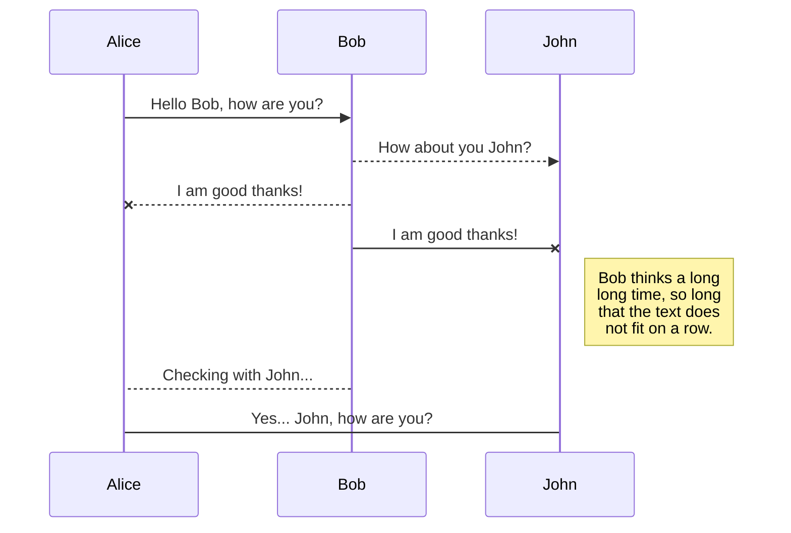
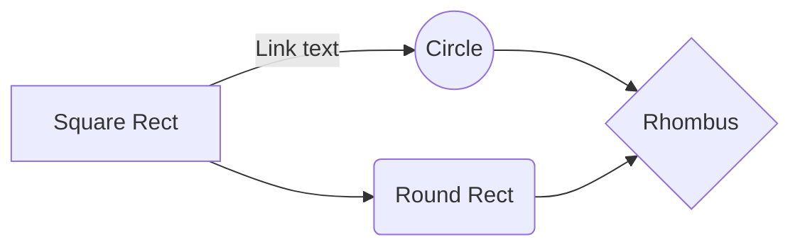

**THIS WAS COMPILED WITH HELP FROM CHATGPT**

# <h1>1. FreeNOS Memory Management System</h1>

## <h2>1A. Identify the specific memory management system used in FreeNOS.</h2>
The specific memory management system used in FreeNOS is a type of segmentation memory management system, called split allocator memory management system. The split allocator is the **SplitAllocator.cpp** which uses four other allocators depending on the situation, which are **Allocator.cpp**, **BitAllocator.cpp**, **BubbleAllocator.cpp**, and **PoolAllocator.cpp**.
#### *- SplitAllocator.cpp*
- This allocator is used to allocate both physical and virtual memory, and is the primary allocator used in FreeNOS. It uses a split allocation scheme where physical memory is allocated separately from virtual memory. This allows for efficient use of physical memory by only mapping necessary parts of virtual memory to physical memory.

-  -  Definition and initialization: `SplitAllocator` is defined with the following constructor, which initializes the object with a physical range, a virtual range, and a page size.
```cpp
SplitAllocator::SplitAllocator(const Allocator::Range physRange, const Allocator::Range virtRange, const Size pageSize)
    : Allocator(physRange)
    , m_alloc(physRange, pageSize)
    , m_virtRange(virtRange)
    , m_pageSize(pageSize)
{
}
```

   - -  Memory availability check: `SplitAllocator::available()` checks the amount of available memory.
```cpp
Size SplitAllocator::available() const
{
    return m_alloc.available();
}
```
 - -  Memory allocation: `SplitAllocator::allocate()` is responsible for allocating a range of memory.
```cpp
Allocator::Result SplitAllocator::allocate(Allocator::Range & args)
{
    return m_alloc.allocate(args);
}
```
 - -  Sparse memory allocation: `SplitAllocator::allocateSparse()` is responsible for allocating a range of memory in fixed-size pages, and reporting the allocated memory ranges using a callback function.
```cpp
Allocator::Result SplitAllocator::allocateSparse(const Allocator::Range & args,
                                                 CallbackFunction *callback)
{
    const Size allocSize = m_pageSize * 8U;
    if (args.size > m_alloc.available())
    {
        return OutOfMemory;
    } else if (args.size % (allocSize)) {
        return InvalidSize;
    }

    for (Size i = 0; i < args.size; i += allocSize)
    {
        Range alloc_args;
        alloc_args.address = 0;
        alloc_args.size = allocSize;
        alloc_args.alignment = ZERO;

        const Result result = static_cast<Allocator *>(&m_alloc)->allocate(alloc_args);
        if (result != Success)
            return result;

        callback->execute(&alloc_args.address);
    }
    return Success;
}
```
 - -  Memory allocation with virtual address: `SplitAllocator::allocate()` is responsible for allocating a range of memory, and returning the corresponding virtual address.
```cpp
Allocator::Result SplitAllocator::allocate(Allocator::Range & phys, Allocator::Range & virt)
{
    Result r = m_alloc.allocate(phys);
    if (r == Success)
    {
        virt.address   = toVirtual(phys.address);
        virt.size      = phys.size;
        virt.alignment = phys.alignment;
    }
    return r;
}
```
 - -  Memory allocation at a specific address: `SplitAllocator::allocateAt()` is responsible for allocating memory at a specific address.
```cpp
Allocator::Result SplitAllocator::allocate(const Address addr)
{
    return m_alloc.allocateAt(addr);
}
```
- -  Memory release: `SplitAllocator::release()` is responsible for releasing a range of memory.
```cpp
Allocator::Result SplitAllocator::release(const Address addr)
{
    return m_alloc.release(addr);
}
```
- -  Convert physical address to virtual address: `SplitAllocator::toVirtual()` converts a physical address to a virtual address.
```cpp
Address SplitAllocator::toVirtual(const Address phys) const
{
    const Size mappingDiff = base() - m_virtRange.address;
    return phys - mappingDiff;
}
```
 - -  Convert virtual address to physical address: `SplitAllocator::toPhysical()` converts a virtual address to a physical address.
```cpp
Address SplitAllocator::toPhysical(const Address virt) const
{
    const Size mappingDiff = base() - m_virtRange.address
}
```
#### *- Allocator.cpp*
This is the base allocator class that provides a generic interface for allocating and freeing memory. It is used as a base class for other allocators.
#### *- BitAllocator.cpp*
This allocator is used to allocate small fixed-size blocks of memory. It maintains a bitmap of the allocated and free blocks and uses bit manipulation operations to efficiently allocate and free blocks.
#### *- BubbleAllocator.cpp*
This allocator is used to allocate variable-sized blocks of memory. It uses a buddy system algorithm to manage the memory space, where memory is divided into blocks of sizes that are powers of 2. The allocator maintains a binary tree structure to track free and allocated blocks.
#### *- PoolAllocator.cpp*
This allocator is used to allocate small fixed-size blocks of memory from a pre-allocated memory pool. It is designed to be fast and efficient for allocating and freeing blocks of the same size, and can be used in situations where there are frequent allocations and deallocations of small objects.
## <h2>1B. Describe its characteristics, numbers, duration, and dynamics.</h2>
#### *- Characteristics*
#### *- Duration*
#### *- Dynamics*
# <h1>2. Discussion and Analysis</h1>
    
    -   Analyze the advantages and disadvantages of the memory management system used in FreeNOS.
    -   Discuss how it compares to other memory management systems.
# <h1>Conclusion</h1>
    
    -   Summarize your findings and observations.
# <h1>References</h1>
    -   List any sources you used during your research.


## UML diagrams

You can render UML diagrams using [Mermaid](https://mermaidjs.github.io/). For example, this will produce a sequence diagram:



And this will produce a flow chart:


